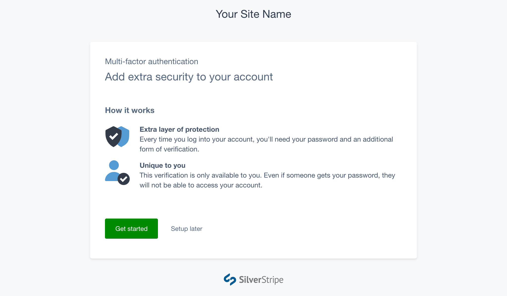
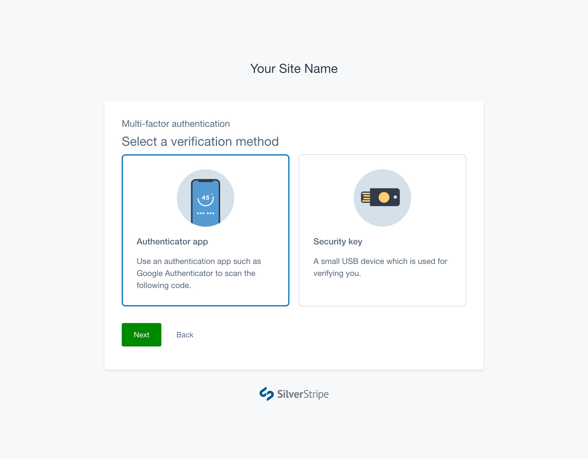
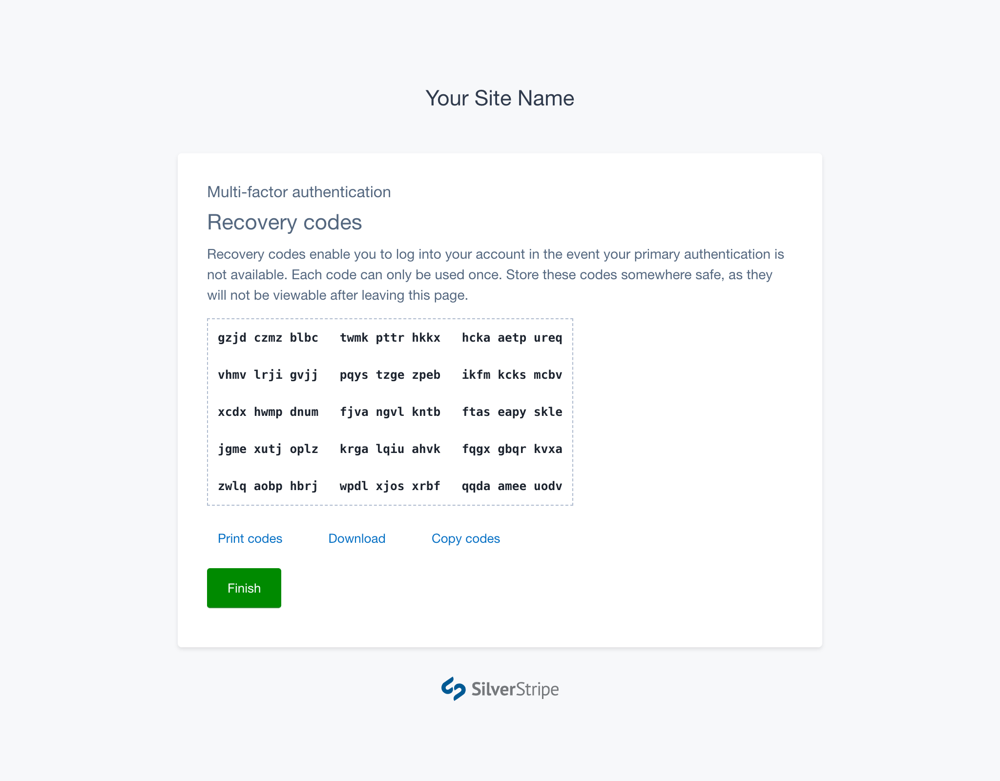

# Setting Up MFA

## 1. Prompted to setup MFA

When MFA is installed on your site, the first time you log in you will be
prompted to set it up for your account.

If MFA is optional, you can choose to skip setup, and you won’t be prompted
again. You can manually add MFA from your profile in the CMS at a later time.

If an administrator has configured MFA as _required_, it will prompt you every
time you attempt to log in. You will be unable to access the CMS until you have
completed this process.

## 2. Selecting an MFA verification method

The number of available methods will vary depending on what has been installed,
what has been configured, and what your browser supports. In most cases, one or
both of the following verification methods will be available:

- Authenticator apps ([Guide](using_authenticator_apps))
- Security keys ([Guide](using_security_keys))

You can have more than one MFA method configured on your account. The first MFA
verification you set up will become your default method. This method displays
first when logging in. You can add more methods or change the default method via
your CMS profile.

[hint]
Setting up additional verification methods will give you more ways to log in if
you lose access to your default method.
[/hint]

## 3. Backup your recovery codes

Once you've set up an MFA verification method, you will be presented with a set
of recovery codes. You can copy, download or print these codes using the actions
shown beneath them.

If you lose access to your phone or security key you can use one of your
recovery codes to login and reset your MFA. Each recovery code can be used once.
Please ensure you store them somewhere safe, as this is the only time they will
be displayed.

[CHILDREN]