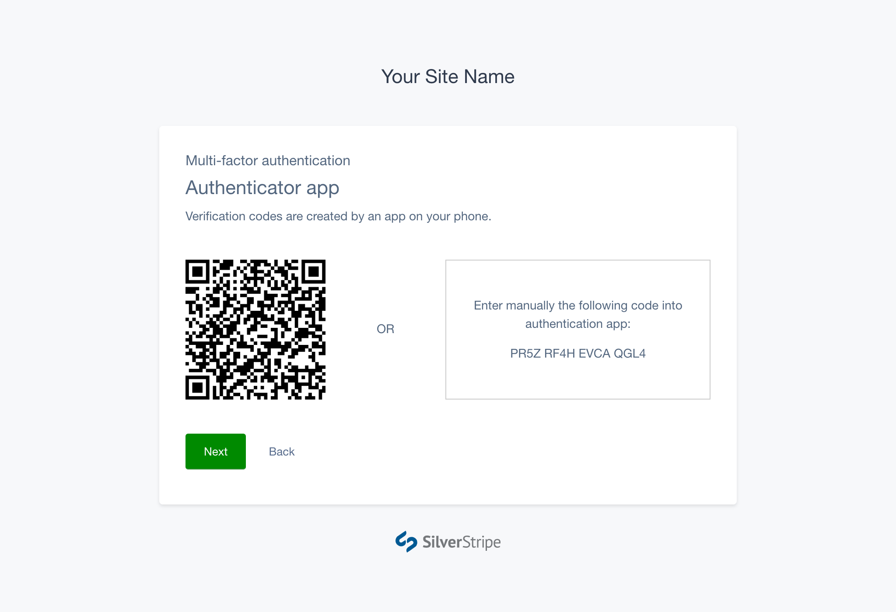
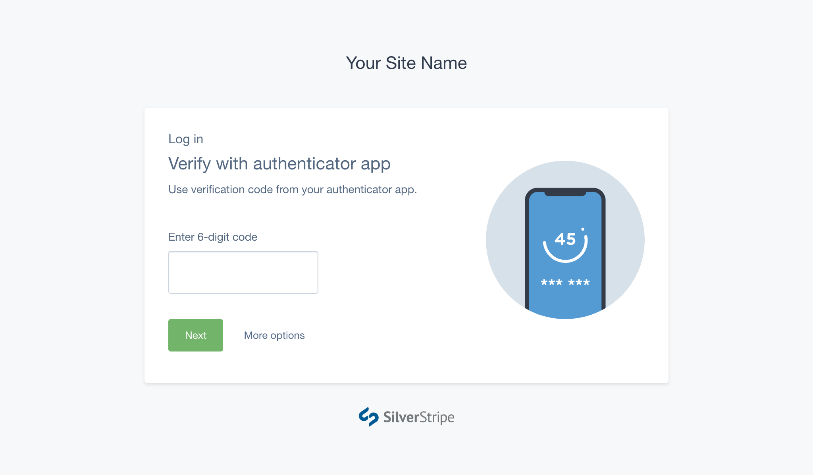

# Using authenticator apps

## Installing an authenticator app

Before you can setup MFA on your account you'll need to install an authenticator
app on your phone which supports Time-based One-Time Passwords (TOTP), such as:

- [Authy](https://authy.com/download/)
- [Google Authenticator](https://support.google.com/accounts/answer/1066447)
- [Microsoft Authenticator](https://www.microsoft.com/en-us/account/authenticator)

## Setting up with an authenticator app

Start the MFA setup process. Pick **Authenticator app** from the Select Method
screen, and press Next.

Open your authentication app on your phone, and either:

- Scan the displayed barcode with the app, or
- Manually enter the displayed secret key into the app.

Once you have set up the app and can see codes being generated, press **Next**.
Enter the verification code generated by the app to verify MFA setup.

## Logging in using your app

Login to your SilverStripe CMS account with your email and password. You’ll then
be prompted to enter a verification code from your authenticator app on your
phone.

Enter the code correctly, and you will be automatically directed to the CMS.

[CHILDREN]