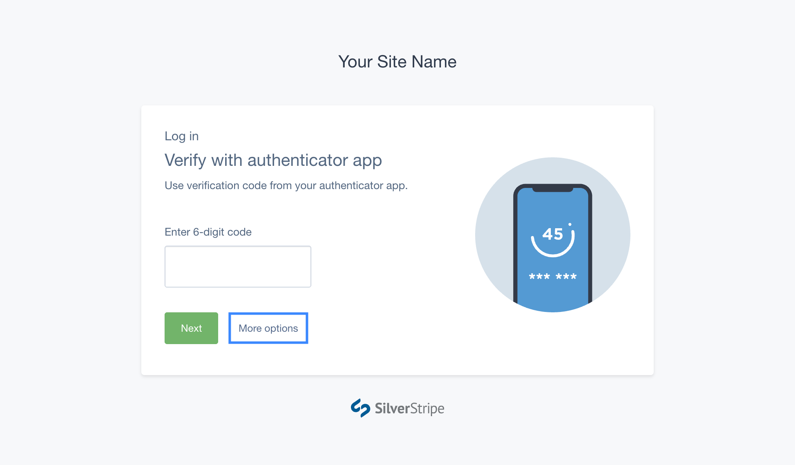
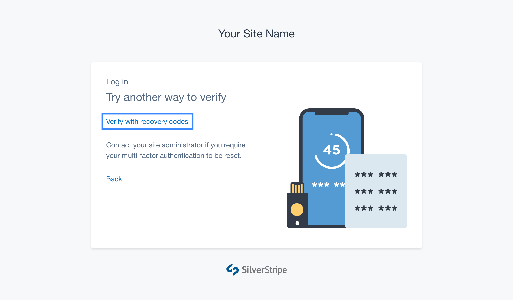
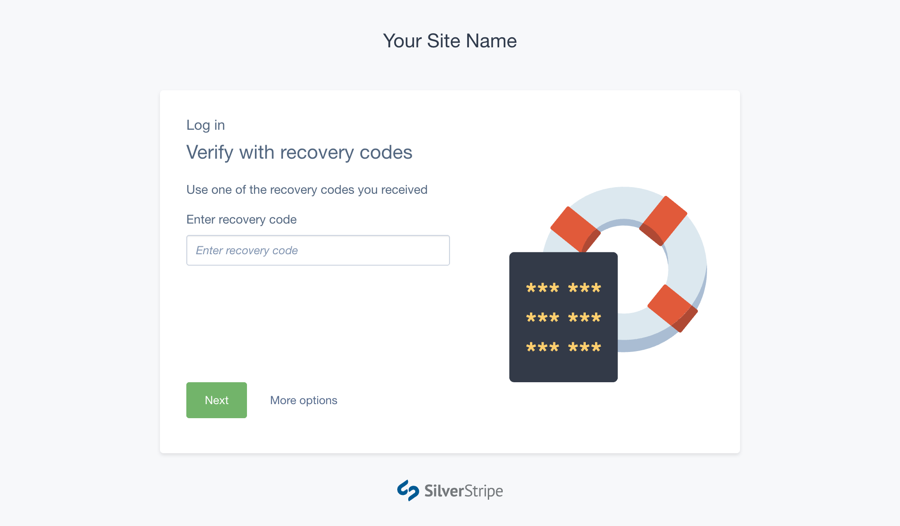

# Regaining access when locked out

## Using backup codes

If your phone or security key is lost/damaged, you can use one of the backup
codes that were generated during the MFA setup process to log in.

Login to your SilverStripe CMS account with your email and password. When
prompted for your primary MFA method, press **Other options** and select
**Verify with backup code**.

Enter a backup code, and press **Verify**. If the backup code is valid, you will
be logged into the CMS.

[hint]
If your primary MFA method is permanently lost, make sure you visit your profile
and remove or reset it before logging out. If you are running out of backup
codes, generate a new set to make sure you don't lose access to your account.
[/hint]

## Resetting your account

If your backup codes are also unavailable, you can contact your site
administrator to have them send you an email to reset your account. This will
enable you to reset both your password and MFA methods. See
[Resetting Accounts](../administrator_manual/resetting_accounts).

[CHILDREN]