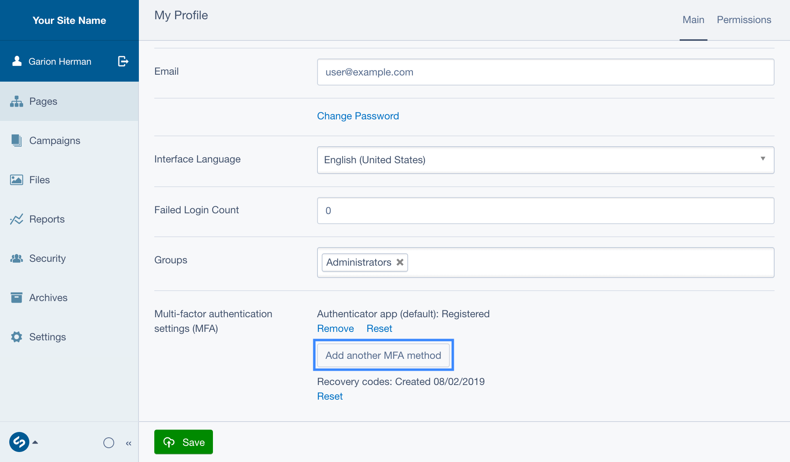
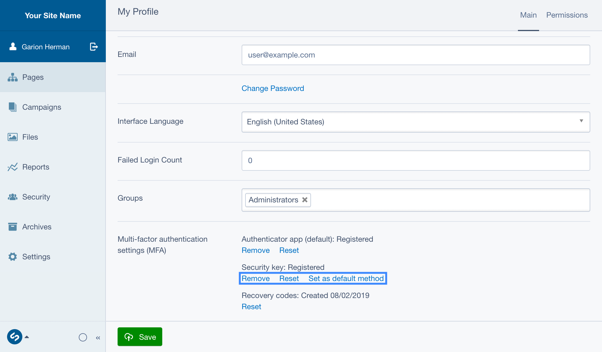
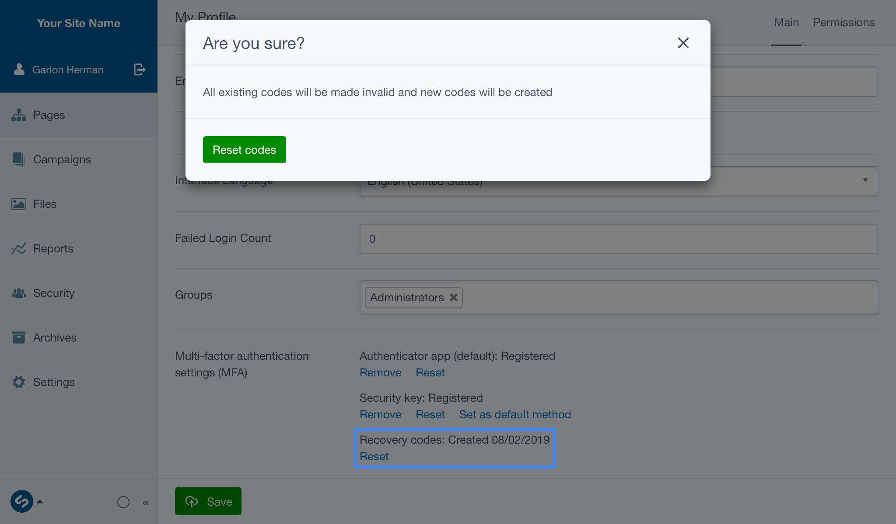

title: Managing your MFA settings
summary: Steps for adding, removing and resetting MFA methods

# Managing your MFA settings

You can add, reset, or remove MFA methods in your CMS Profile, which can be
visited by clicking on your name in the top left area of the CMS interface. The
MFA settings are protected by "sudo mode", which means you may need to
re-enter your password to access them.

## Adding additional methods

1. Go to your profile page, and find the Multi-factor authentication settings
   area. If you are prompted for your password, enter it.
2. Press **Add another MFA method**. If prompted, pick which method to set up.
3. Follow the relevant guide for setting up the method:
   - [Authenticator app](02_Using_authenticator_apps.md)
   - [Security key](03_Using_security_keys.md)

## Removing, resetting and changing default MFA methods

1. Go to your profile page, and find the Multi-factor authentication settings
   area. If you are prompted for your password, enter it.
2. Find the method you want to modify, and press the action beneath it that you
   want to take. Actions include:
   - **Remove:** This will delete the method. This action is only available if
     you have multiple methods registered, or if MFA is optional for your site.
   - **Reset:** Takes you through the setup process for the method, replacing
     the existing method. Useful if you lose access to your old key/device.
   - **Set as default method:** Only visible if you have multiple methods, this
     will toggle which method is displayed first during login.

## Resetting recovery codes

1. Go to your profile page, and find the Multi-factor authentication settings
   area. If you are prompted for your password, enter it.
2. Find the Backup codes method, and press the **Reset** action.
3. You will be presented with a new set of backup codes, which you should store
   in a safe place.

