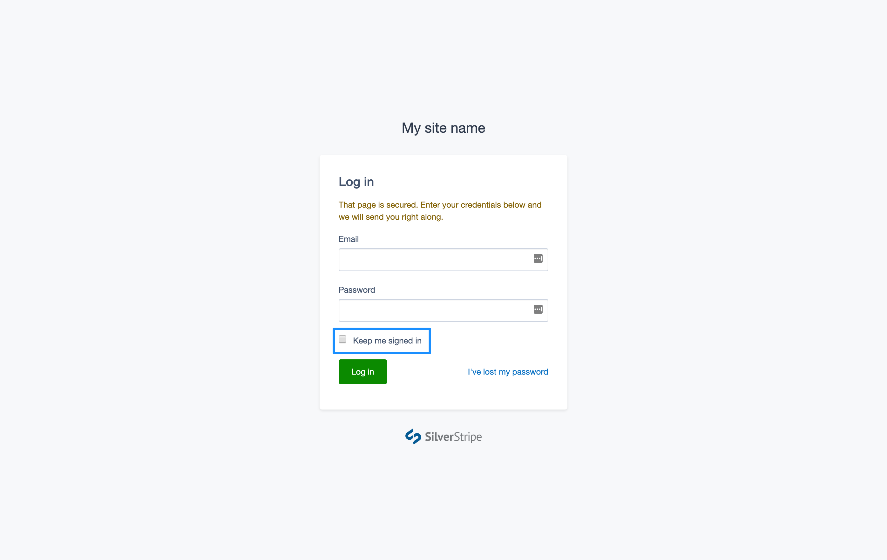

title: Remember trusted devices
summary: Steps to stay signed in on a trusted device

# Remember trusted devices

In order to avoid repeat requests to log in with MFA through a device you know to be secure, it is possible to assign your device as a 'trusted device' at the login screen.

## Marking you current device as trusted

1. Visit the login screen.

2. In addition to entering your Email and Password, choose the option to **Keep me signed in**.

3. Continue to log in with your registered MFA method.

## How trusted devices work

When logging in with the **Keep me signed in** option selected, a time-based cookie will be saved to the web browser being used by your current device which will act to remember you in subsequent visits to your site.

In addition to remembering the device, your username and password will also be remembered.

It is important that you only choose to use this option on a device you know to be secure. A secure device may be one that requires you to log in before being able to access the Internet, for example one within an office network, or a personal mobile device with a passcode.

**A device shared between multiple people would not be considered secure and you should not use this option.**

This functionality is provided by default with the Silverstripe CMS however it may be disabled by a Developer in some projects.
