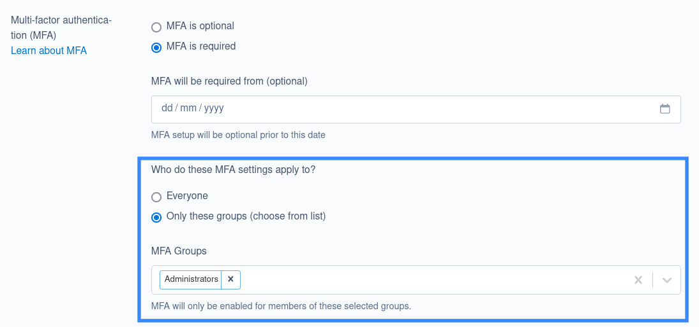

# Configuring MFA for your site

To modify your site's MFA configuration, navigate to the **Settings** section,
and select the **Access** tab.

Here, you can select one of two modes of operation for MFA on your site:

## MFA is optional (default)

This is the default setting when MFA is installed. Everyone will be prompted to
set up multi-factor authentication upon their first login, but they can skip the
setup process and continue to log in as they did before. They will be able to
set up MFA later via their Profile page in Silverstripe CMS.

## MFA is required

Everyone without MFA setup will be prompted with a message requiring them to
setup MFA when they attempt to log in. If they choose not to proceed with setup,
they will remain logged out.

Once a user has set up an MFA method on their account, they will not be able to
remove it unless they have added another.

**Set a date.**

As an administrator, you can set the date for when MFA will be become mandatory.
MFA will be optional before this date, however users without MFA configured will
be prompted with the option to set it up on every login, until MFA is set up.

## Limit MFA to specific groups

While it is generally recommended to apply the above settings to _all_ users globally,
you can choose to limit MFA registration to specific groups by setting "Who do these
MFA settings apply to?" to "Only these groups" and then selecting the relevant groups
from the dropdown field.

Note that any users who have already registered MFA for their account prior to changing
this setting will still need to use MFA to log in, even if they are not in one of the
groups you have selected.

