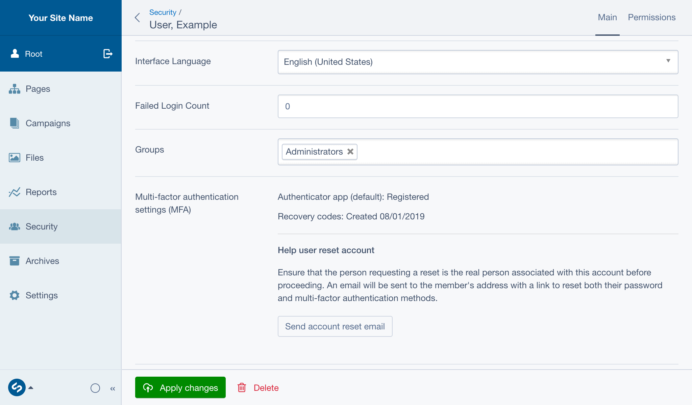
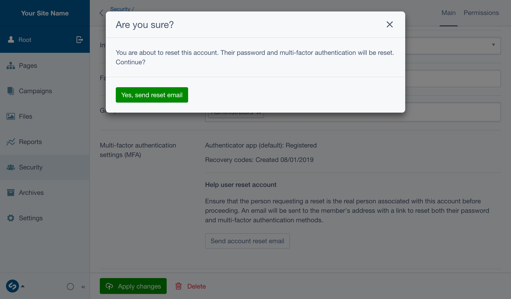

title: Resetting accounts
summary: How to reset a user's account if they lose access to it

# Resetting accounts

As an administrator, you can assist other users that have been locked out of
their accounts by sending them an email to reset their account via the CMS.

1. Verify that the person requesting the reset owns the account.
2. Navigate to the **Security** section, and select the member requesting an
   account reset.
3. Locate the **Multi-factor Authentication settings (MFA)** field, and if
   prompted, re-enter your password to unlock it. Press
   **Send account reset email**, and confirm the action in the dialog.

The account holder will receive an account reset link via email, which will
enable them to reset their password and MFA settings.
